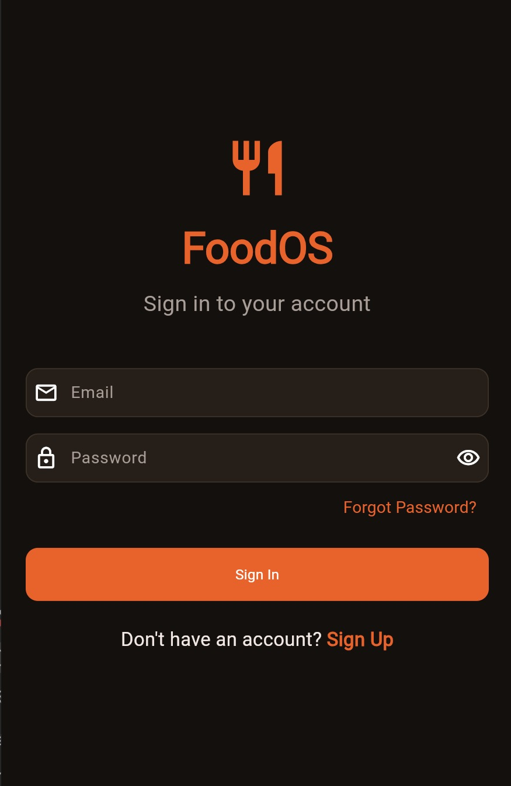
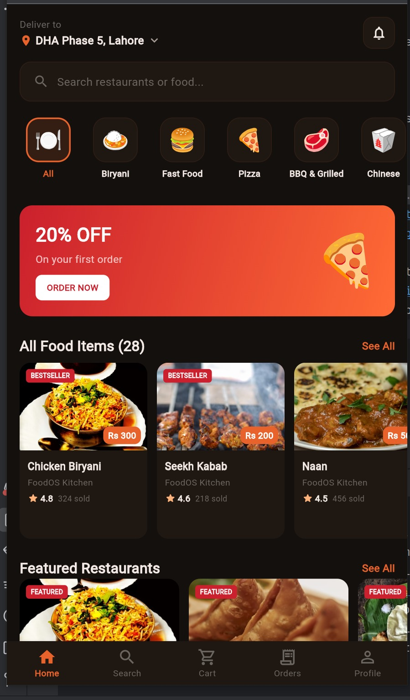
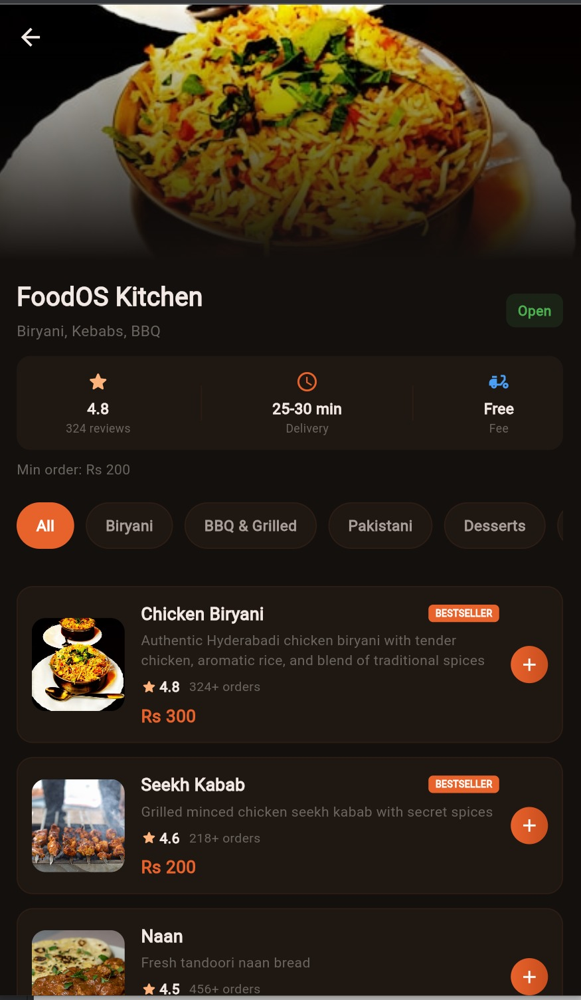
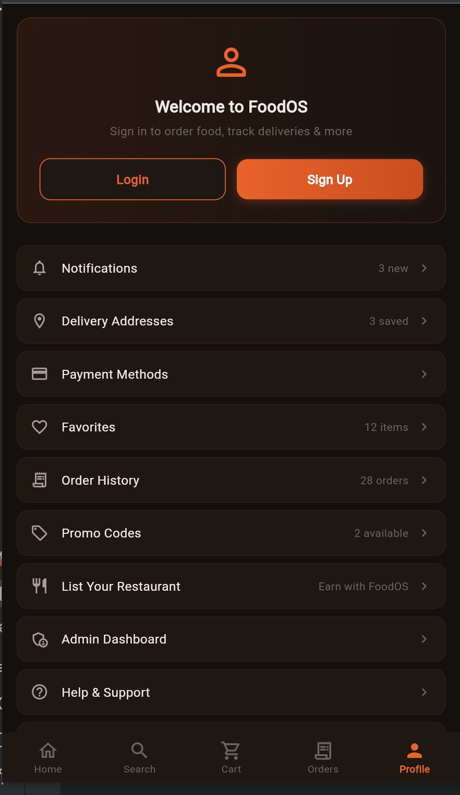

# 🍔 Multi Food App

> A full-stack food delivery & restaurant management platform built with **Flutter** and **Node.js**.  
> Supports multiple roles including Admin, Vendor, Customer, and Rider with real-time order tracking and a complete POS system.  
> Features inventory management, analytics reports, kitchen display, and a complete onboarding flow for businesses.

---
## 📸 Screenshots
<p align="center">
  
  
</br>
  
  
</p>

## 📱 Tech Stack

| Layer | Technology |
|-------|-----------|
| Frontend | Flutter (Dart) |
| Backend | Node.js + TypeScript |
| Database | SQLite (via Prisma ORM) |
| Auth | JWT |
| State Management | Riverpod |

---

## 🗂️ Project Structure

```
multi_food_app/
├── backend/                  # Node.js + TypeScript API server
│   ├── src/
│   │   ├── controllers/      # Business logic
│   │   ├── routes/           # API routes
│   │   ├── middleware/       # Auth middleware
│   │   └── index.ts          # Entry point
│   ├── prisma/
│   │   └── schema.prisma     # Database schema
│   └── package.json
│
└── frontend/                 # Flutter mobile app
    ├── lib/
    │   ├── features/
    │   │   ├── auth/         # Login & registration
    │   │   ├── dashboard/    # Admin dashboard
    │   │   ├── customer_app/ # Customer-facing app
    │   │   ├── vendor/       # Vendor management
    │   │   ├── pos/          # Point of Sale
    │   │   ├── menu/         # Menu management
    │   │   ├── orders/       # Order management
    │   │   ├── inventory/    # Inventory & suppliers
    │   │   ├── delivery/     # Riders & delivery
    │   │   ├── kitchen/      # Kitchen display system
    │   │   ├── reports/      # Analytics & reports
    │   │   ├── employees/    # Staff management
    │   │   ├── tables/       # Table layout
    │   │   ├── expenses/     # Expense tracking
    │   │   ├── notifications/# Push notifications
    │   │   └── settings/     # App settings
    │   └── main.dart
    └── pubspec.yaml
```

---

## 🚀 Features

### 👤 Multi-Role System
- **Admin** — Full platform control, user management, restaurant approvals
- **Vendor** — Restaurant dashboard, menu & order management
- **Customer** — Browse restaurants, place orders, track delivery
- **Rider** — Accept & deliver orders, real-time status updates

### 🏪 Restaurant Management
- Onboarding flow for new businesses
- Branch setup and management
- Menu categories & item management
- Table layout configuration

### 🛒 Order & POS System
- Point of Sale (POS) screen
- Order history & details
- Payment processing
- Kitchen Display System (KDS)

### 📦 Inventory Management
- Stock tracking & adjustments
- Supplier management
- Purchase order creation

### 📊 Analytics & Reports
- Sales reports
- Profit & loss reports
- Customer analytics
- Staff performance reports
- Inventory reports
- Expense reports

### 🎁 More Features
- Promo codes & discounts
- Subscription management
- Push notifications
- Daily closing & expense tracking
- Tip rider functionality
- Scheduled orders

---

## ⚙️ Getting Started

### Backend Setup

```bash
cd backend
npm install
npx prisma generate
npx prisma db push
npm run dev
```

### Frontend Setup

```bash
cd frontend
flutter pub get
flutter run
```

---

## 📄 License

This project is for private/commercial use. All rights reserved © 2026.
